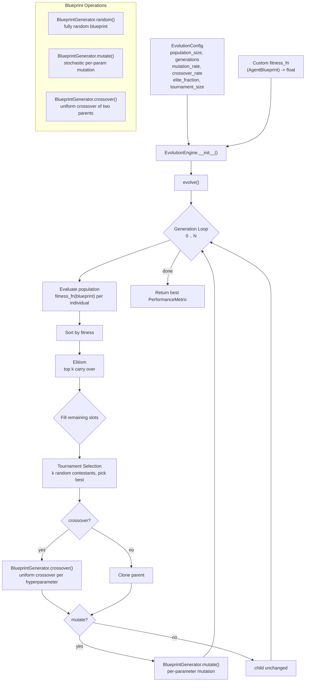

# aumai-metaagent

> **Experimental** — AumAI is frontier research software. APIs may change between
> minor releases. Use in production at your own risk.

An agent that learns to build better agents. Implements evolutionary meta-learning for
agent architecture search: population-based search over neural network hyperparameters
using tournament selection, crossover, and mutation. Part of the
[AumAI](https://github.com/aumai) open-source agentic infrastructure suite.

[](https://github.com/aumai/aumai-metaagent/actions)
[](https://pypi.org/project/aumai-metaagent/)
[](LICENSE)
[](https://pypi.org/project/aumai-metaagent/)

---

## What is this?

Breeders of racing horses do not design horses from scratch. They maintain a population
of horses, race them to identify the best performers, breed the top finishers with each
other, and occasionally introduce random variation. Over generations, the population
drifts toward horses that are better and better at racing.

`aumai-metaagent` applies this same principle to AI agent design. Instead of horses,
it evolves **agent blueprints** — Pydantic models that fully describe the hyperparameters
of a neural network agent: hidden layer sizes, activation functions, optimizer type,
learning rate, dropout, memory buffer size, and exploration rate. Instead of racing,
it evaluates blueprints with a **fitness function** you provide.

Over generations, the population converges toward blueprints that perform better on
your task — without you ever hand-tuning a single hyperparameter.

---

## Why does this matter?

Manual hyperparameter tuning is one of the most time-consuming activities in applied
machine learning. Neural Architecture Search (NAS) automates this but typically requires
enormous compute budgets (hundreds of GPU-hours). Evolutionary methods offer a practical
middle ground: better than grid search, dramatically cheaper than full NAS.

For AI agent systems specifically:
- **Agent architectures are high-dimensional** — there are exponentially many
  combinations of layer size, depth, learning rate, optimizer, and memory size.
- **Evaluation is expensive** — each candidate must be trained and tested in a real
  environment before its fitness is known.
- **Evolutionary search is sample-efficient** — it exploits structure in the fitness
  landscape (good layer sizes tend to co-occur with good learning rates) through
  crossover, rather than sampling independently like grid search.

`aumai-metaagent` is the research skeleton for this approach. You plug in your fitness
function; the engine handles the evolutionary loop.

---

## Architecture



---

## Features

- **Evolutionary loop** — tournament selection, elitism, configurable crossover rate,
  configurable mutation rate, all in `EvolutionEngine.evolve()`.
- **Blueprint generation** — `BlueprintGenerator` generates random blueprints, mutates
  single blueprints, and crosses over two parents into a child.
- **Uniform crossover** — each hyperparameter in the child is independently drawn from
  either parent with 50% probability; layer architectures use length-bounded merging.
- **Per-parameter mutation** — each hyperparameter mutates independently at rate
  `mutation_rate`. Architecture mutations include add/remove/resize layer operations.
- **Elitism** — a configurable top fraction of blueprints survive to the next generation
  unchanged, preventing regression.
- **Injected fitness function** — pass any `Callable[[AgentBlueprint], float]` at
  construction time. A synthetic default fitness is included for demo purposes only.
- **Full evolution history** — `EvolutionEngine.get_history()` returns every
  `PerformanceMetric` ever recorded, one per (blueprint, generation).
- **Reproducibility** — all randomness seeded through `EvolutionConfig.seed`.
- **CLI** — `aumai-metaagent evolve` and `aumai-metaagent generate` for quick
  exploration without writing code.
- **Pydantic v2 models** — blueprints, metrics, and config are all validated models,
  JSON-serialisable.

---

## Quick Start

### Installation

```bash
pip install aumai-metaagent
```

Or from source:

```bash
git clone https://github.com/aumai/aumai-metaagent
cd aumai-metaagent
pip install -e ".[dev]"
```

### Minimal example

```python
from aumai_metaagent.core import EvolutionEngine
from aumai_metaagent.models import EvolutionConfig

config = EvolutionConfig(population_size=20, generations=10, seed=42)
engine = EvolutionEngine(config)
best = engine.evolve()

print(best.blueprint_id)   # e.g. "bp_3a7f2c11"
print(best.fitness)        # e.g. 0.7341
print(best.generation)     # e.g. 7
```

### With a custom fitness function

```python
from aumai_metaagent.models import AgentBlueprint

def my_fitness(blueprint: AgentBlueprint) -> float:
    """Prefer shallow networks with low learning rates."""
    depth_penalty = max(0.0, len(blueprint.hidden_layers) - 2) * 0.1
    lr_score = 1.0 - abs(blueprint.learning_rate - 3e-4) / 1e-3
    return max(0.0, min(1.0, lr_score - depth_penalty))

config = EvolutionConfig(population_size=30, generations=20, seed=0)
engine = EvolutionEngine(config, fitness_fn=my_fitness)
best = engine.evolve()
print(best.fitness)
```

### CLI

```bash
# Evolve for 100 generations with population 30
aumai-metaagent evolve --generations 100 --population 30 --seed 42

# Generate 5 random blueprints as JSON
aumai-metaagent generate --count 5 --seed 0

# Save evolution history for analysis
aumai-metaagent evolve --generations 50 --history-output history.json
```

---

## CLI Reference

### `aumai-metaagent evolve`

Run the evolutionary meta-learning loop.

```
Usage: aumai-metaagent evolve [OPTIONS]

Options:
  --generations INTEGER       Number of generations.  [default: 10]
  --population INTEGER        Population size.  [default: 20]
  --tournament-size INTEGER   Tournament size.  [default: 4]
  --mutation-rate FLOAT       Per-parameter mutation probability.  [default: 0.2]
  --crossover-rate FLOAT      Probability of crossover vs. clone.  [default: 0.7]
  --elite-fraction FLOAT      Fraction of top individuals carried forward.  [default: 0.1]
  --seed INTEGER              Random seed.
  --output PATH               Save best result JSON.  [default: evolution_result.json]
  --history-output PATH       Save full evolution history JSON.
  --help
```

**Examples:**

```bash
# Standard run
aumai-metaagent evolve --generations 50 --population 30 --seed 42

# High exploration
aumai-metaagent evolve --mutation-rate 0.4 --crossover-rate 0.9 --elite-fraction 0.05

# Preserve elites aggressively
aumai-metaagent evolve --elite-fraction 0.3 --tournament-size 8

# Save everything
aumai-metaagent evolve \
    --generations 100 \
    --population 50 \
    --output best.json \
    --history-output history.json
```

### `aumai-metaagent generate`

Generate random agent blueprints and print or save as JSON.

```
Usage: aumai-metaagent generate [OPTIONS]

Options:
  --count INTEGER    Number of blueprints to generate.  [default: 1]
  --seed INTEGER     Random seed.
  --output PATH      Output JSON path. Defaults to stdout.
  --help
```

**Examples:**

```bash
# Print one blueprint to stdout
aumai-metaagent generate

# Generate 10 blueprints to a file
aumai-metaagent generate --count 10 --seed 7 --output blueprints.json

# Pipe into jq for inspection
aumai-metaagent generate --count 3 | jq '.[].hidden_layers'
```

---

## Python API Examples

### Inspecting the evolution history

```python
from aumai_metaagent.core import EvolutionEngine
from aumai_metaagent.models import EvolutionConfig

config = EvolutionConfig(population_size=20, generations=10, seed=0)
engine = EvolutionEngine(config)
engine.evolve()

history = engine.get_history()
print(f"Total evaluations: {len(history)}")  # 200 (20 * 10)

# Best per generation
from collections import defaultdict
by_gen: dict[int, list[float]] = defaultdict(list)
for metric in history:
    by_gen[metric.generation].append(metric.fitness)

for gen, fitnesses in sorted(by_gen.items()):
    print(f"Gen {gen:3d}: best={max(fitnesses):.4f} mean={sum(fitnesses)/len(fitnesses):.4f}")
```

### Generating, mutating, and crossing over blueprints manually

```python
import random
from aumai_metaagent.core import BlueprintGenerator

rng = random.Random(42)
gen = BlueprintGenerator(rng=rng)

# Generate two random blueprints
parent_a = gen.random(generation=0)
parent_b = gen.random(generation=0)

# Mutate parent_a
mutant = gen.mutate(parent_a, mutation_rate=0.4)

# Cross over two parents
child = gen.crossover(parent_a, parent_b)

print(parent_a.hidden_layers)  # e.g. [128, 256]
print(child.hidden_layers)     # e.g. [128, 64]  (mixed)
print(child.parent_ids)        # [parent_a.blueprint_id, parent_b.blueprint_id]
```

### Serialising blueprints

```python
import json

# Single blueprint
blueprint_json = parent_a.model_dump_json(indent=2)
print(blueprint_json)

# Reload
from aumai_metaagent.models import AgentBlueprint
loaded = AgentBlueprint.model_validate_json(blueprint_json)
print(loaded.blueprint_id)

# Compute estimated parameter count
print(loaded.parameter_count())  # e.g. 98432
```

### Loading evolution results from CLI output

```python
from aumai_metaagent.models import PerformanceMetric

with open("evolution_result.json") as fh:
    best = PerformanceMetric.model_validate_json(fh.read())

print(best.fitness)
print(best.success_rate)
print(best.generation)
```

---

## Configuration Reference

### `EvolutionConfig`

| Field | Type | Default | Constraint | Description |
|---|---|---|---|---|
| `population_size` | `int` | `20` | `> 0` | Number of blueprints per generation. |
| `generations` | `int` | `10` | `> 0` | Total evolution generations. |
| `tournament_size` | `int` | `4` | `> 0` | Contestants in each tournament selection. |
| `mutation_rate` | `float` | `0.2` | `[0, 1]` | Probability of mutating each parameter. |
| `crossover_rate` | `float` | `0.7` | `[0, 1]` | Probability of crossover vs. simple clone. |
| `elite_fraction` | `float` | `0.1` | `[0, 1]` | Fraction of top individuals carried forward. |
| `seed` | `int \| None` | `None` | — | Random seed. |
| `evaluation_episodes` | `int` | `10` | `> 0` | Passed to fitness function if it uses it. |

**Tuning guidance:**

- `population_size`: Larger populations explore more but cost more per generation.
  Start at 20; increase if you see premature convergence.
- `mutation_rate`: `0.1-0.3` is a practical range. Too low = exploitation only; too
  high = random walk.
- `crossover_rate`: `0.6-0.8` is standard. Lower values mean more cloning from single
  parents.
- `elite_fraction`: `0.05-0.2`. Too high and diversity collapses; too low and good
  blueprints are lost by random variation.
- `tournament_size`: Larger tournaments = stronger selection pressure. `2-8` covers
  most use cases.

---

## How It Works — Deep Dive

### Blueprint Representation

An `AgentBlueprint` encodes:
- **Architecture**: `hidden_layers` — a list of integer layer sizes (1 to 4 layers,
  sizes from `[16, 32, 64, 128, 256, 512]`).
- **Activation**: one of `relu`, `tanh`, `sigmoid`, `linear`, `gelu`.
- **Optimizer**: one of `adam`, `sgd`, `rmsprop`, `adamw`.
- **Learning rate**: log-uniform in `[1e-5, 1e-1]`.
- **Dropout rate**: uniform in `[0.0, 0.5]`.
- **Memory size**: `[256, 512, 1000, 2000, 5000]` (replay buffer or context window).
- **Exploration rate**: uniform in `[0.01, 0.5]` (epsilon-greedy).

### Generation Lifecycle

1. **Evaluate** — call `fitness_fn(blueprint)` for every individual. Store as
   `PerformanceMetric`.
2. **Sort** — rank by fitness descending.
3. **Elitism** — carry the top `elite_fraction * population_size` individuals unchanged.
4. **Fill** — repeat until population is full:
   - **Tournament select** a parent: pick `tournament_size` random contestants, return
     the fittest.
   - With probability `crossover_rate`: **tournament select** a second parent and
     **crossover** with the first.
   - With probability `mutation_rate`: **mutate** the child.
   - Stamp the child with the next generation number.
5. **Repeat** for the next generation.

### Crossover Mechanics

For scalar hyperparameters (activation, optimizer, learning rate, dropout, memory,
exploration), each is independently drawn from either parent with 50% probability.
For `hidden_layers`, the child's length is a random integer between `min` and `max`
of the two parents' lengths; the shared prefix positions are drawn from either parent
at 50%; extra positions come from the longer parent.

### Mutation Mechanics

Each hyperparameter mutates independently with probability `mutation_rate`. Architecture
mutation is a three-way choice: add a layer (if below max), remove a layer (if above
min), or resize a randomly chosen layer. Scalar mutations resample from the full range,
not a local neighbourhood. This is "wide" mutation — appropriate when the fitness
landscape is not unimodal.

---

## Integration with Other AumAI Projects

- **aumai-treesearch** — Use `SearchResult.best_value` as the fitness signal for
  `EvolutionEngine`. Blueprints are evaluated by how well MCTS plans when using them
  as the agent's decision model.
- **aumai-consensus** — After evolving candidate blueprints, use a `ConsensusManager`
  with multiple evaluator agents voting on which blueprint to deploy.
- **aumai-specs** — Encode `AgentBlueprint.extra_params` with structured task
  specifications validated by aumai-specs schemas.

---

## Contributing

See `CONTRIBUTING.md`.

```bash
pip install -e ".[dev]"
make test
make lint
```

---

## License

Apache 2.0. See `LICENSE`.

---

## Research Context and Disclaimers

Neuroevolution — evolving neural network architectures and weights — dates to the
NEAT algorithm (Stanley & Miikkulainen, 2002). Modern Neural Architecture Search (NAS)
benchmarks (Zoph & Le, 2017; Real et al., 2019) use evolutionary methods at scale.

`aumai-metaagent` is a lightweight, framework-agnostic implementation of the
**evolutionary outer loop** only. It generates and evolves blueprints (hyperparameter
descriptions) but does not train neural networks itself. The actual training and
evaluation must be implemented in the `fitness_fn` you provide.

The bundled default fitness (`_default_fitness`) is a synthetic proxy that rewards
moderate depth, a learning rate near `1e-3`, tanh activation, and Adam optimizer. It
exists solely to demonstrate the evolutionary loop without requiring external ML
frameworks. It has no validity as a real fitness measure.

> **Disclaimer**: This library provides the evolutionary search framework only. The
> quality of results depends entirely on the quality of your fitness function and the
> realism of your evaluation environment. No performance guarantees are made for any
> specific downstream task.
